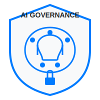

# AI Governance Dashboard

An AI-powered dashboard for managing AI governance, risk assessment, and compliance workflows.

## Overview

The AI Governance Dashboard provides a comprehensive solution for organizations to manage the governance, risk, and compliance aspects of their AI systems. It leverages AI agents to automate key governance tasks, assess risks, monitor compliance, and generate insightful reports.



## Key Features

- **AI-Powered Governance**: Automatically generate governance policies and identify governance gaps
- **Risk Assessment**: Assess AI risks using NLP to analyze model documentation
- **Compliance Monitoring**: Track compliance metrics in real-time with anomaly detection
- **Automated Reporting**: Generate comprehensive reports with AI-driven insights
- **Intuitive Interface**: Clean, professional UI with minimal clicks required

## Architecture

The dashboard is built with a modern, modular architecture:

- **Backend**: FastAPI RESTful API running on Python
- **Frontend**: JavaScript/React-based UI with Chart.js for data visualization
- **AI Agents**: Specialized agents for governance, risk, monitoring, and reporting
- **Database**: SQLite for lightweight data storage

## Components

### Backend Components

- **FastAPI Application**: Provides RESTful endpoints for all dashboard functionality
- **Governance Module**: Policy management and generation
- **Risk Assessment Module**: Risk analysis and classification
- **Compliance Module**: Monitoring of compliance metrics
- **Reporting Module**: Generation of insights and reports

### Frontend Components

- **Dashboard**: Overview of key metrics and charts
- **Governance Page**: Policy management interface
- **Risk Assessment Page**: Risk analysis tools
- **Compliance Monitoring**: Real-time compliance tracking
- **Reporting**: Report generation and viewing

## AI Agents

The system uses specialized AI agents:

1. **Governance Agent**: Automates policy generation and governance gap analysis
2. **Risk Assessment Agent**: Uses NLP to classify AI risks based on documentation
3. **Monitoring Agent**: Continuously tracks compliance metrics and flags anomalies
4. **Reporting Agent**: Generates automated compliance reports with insights

## Getting Started

### Prerequisites

- Python 3.8+
- Node.js and npm
- Required Python libraries: fastapi, uvicorn, plotly, pandas, etc.
- Required JS libraries: React, Chart.js, GSAP, etc.

### Installation

1. Clone the repository:
   ```
   git clone https://github.com/your-org/ai-governance-dashboard.git
   cd ai-governance-dashboard
   ```

2. Install Python dependencies:
   ```
   pip install -r requirements.txt
   ```

3. Install JavaScript dependencies:
   ```
   npm install
   ```

### Running the Application

The application consists of both backend and frontend components that need to be run simultaneously:

1. Start the backend server:
   ```
   python main.py
   ```

2. Start the frontend development server:
   ```
   npx webpack serve --mode development
   ```

Alternatively, use the Complete AI Governance Platform workflow which starts both services:
```
# This will start both backend and frontend in parallel
python main.py & npx webpack serve --mode development
```

The application will be available at http://localhost:5000

## Project Structure

```
├── app/                    # Main application package
│   ├── api/                # API endpoints
│   ├── core/               # Core business logic and AI agents
│   ├── domain/             # Domain models and repositories
│   └── infrastructure/     # Infrastructure services
├── assets/                 # Static assets
├── database/               # Database models and initialization
├── frontend/               # React frontend code
│   ├── public/             # Public assets
│   └── src/                # Source code
│       ├── components/     # React components
│       ├── pages/          # Page components
│       ├── services/       # API service clients
│       └── styles/         # CSS styles
├── pages/                  # Streamlit pages (legacy)
├── static/                 # Static files for serving
│   ├── css/                # CSS stylesheets
│   ├── js/                 # JavaScript files
│   └── index.html          # Main HTML template
├── utils/                  # Utility functions
└── main.py                 # Application entry point
```

## Features

### Governance Management
- View and manage governance policies
- Generate new policies using AI
- Identify governance gaps

### Risk Assessment
- Assess AI risks from model documentation
- Analyze risk factors across different categories
- Identify high-risk AI systems

### Compliance Monitoring
- Monitor compliance metrics in real-time
- Set up automated alerts for compliance issues
- Track compliance status across AI systems

### Reporting
- Generate comprehensive governance reports
- Get AI-driven insights and recommendations
- Export reports in various formats

## API Documentation

The API is documented using FastAPI's automatic documentation. When running the application, you can access the API documentation at:

- Swagger UI: http://localhost:5000/docs
- ReDoc: http://localhost:5000/redoc

## Contributing

Contributions are welcome! Please feel free to submit a Pull Request.

## License

This project is licensed under the ISC License - see the LICENSE file for details.
